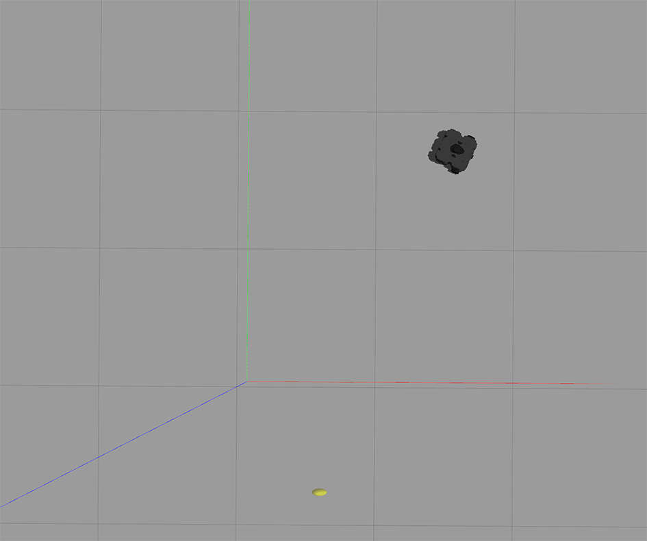
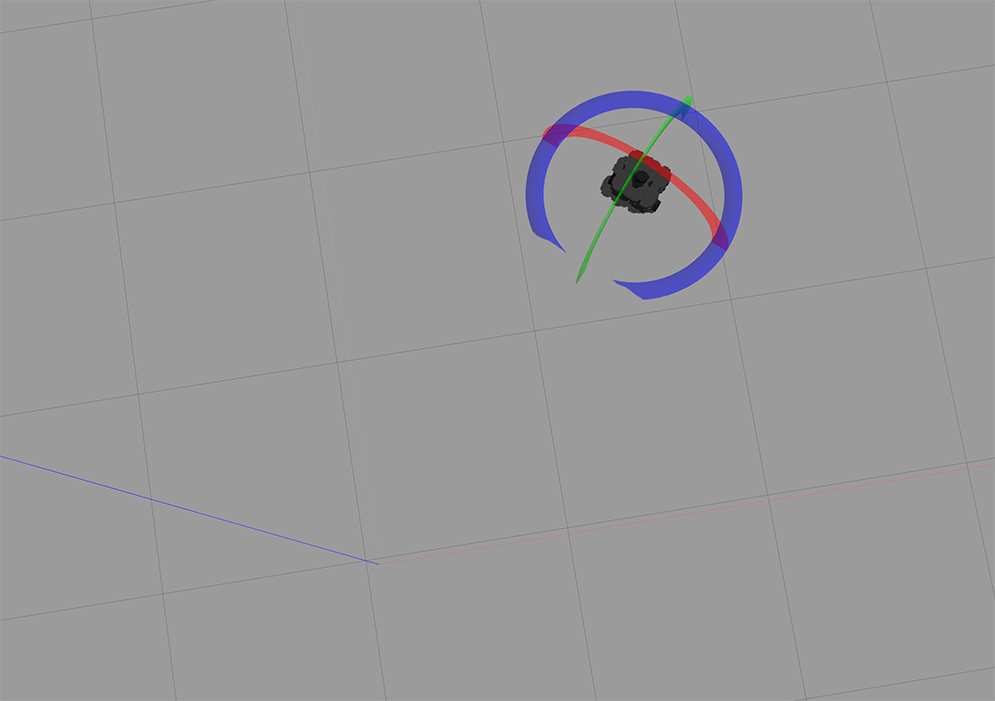
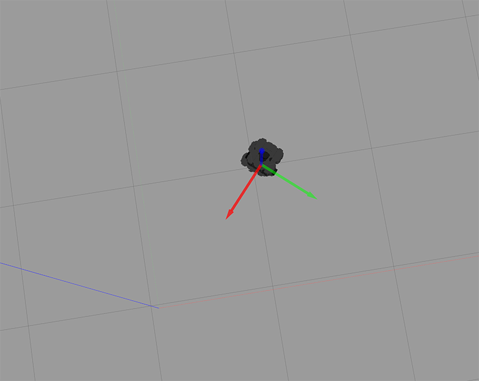
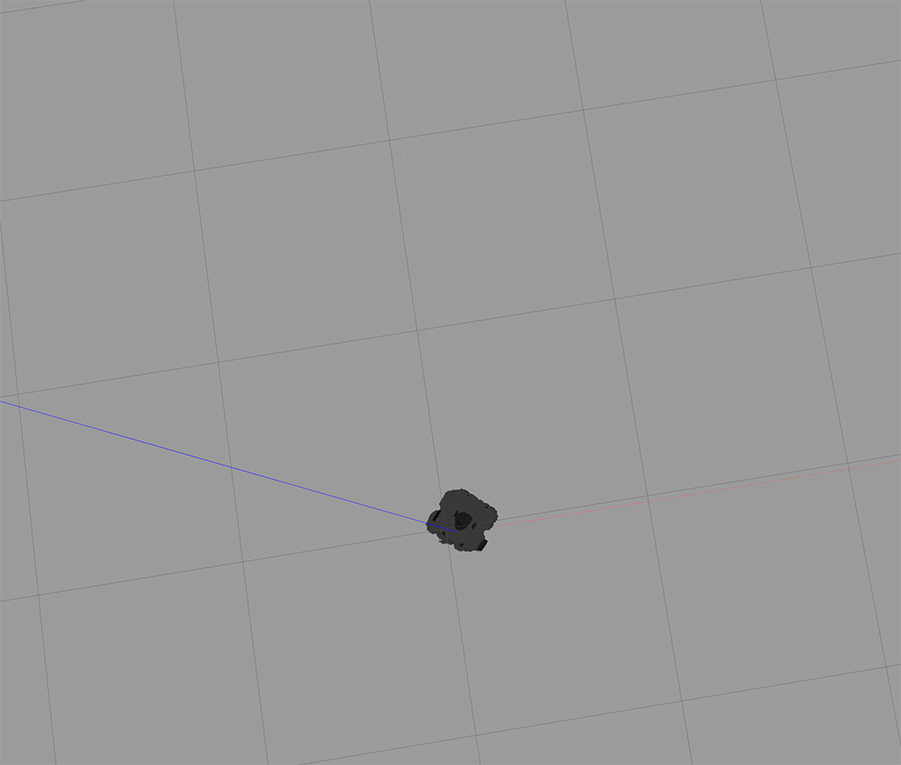

# Robótica Computacional

## Prova AI - GABARITO

**Você deve escolher somente 3 questões para fazer. Todo mundo que fizer pelo menos uma questão ganha 0.1**


Existe algumas dicas de referência rápida de setup [instrucoes_setup.md](instrucoes_setup.md)


# Questões


## Questão 1  (3.3 pontos)

[Discussão da solução aqui](./q1/Solucao_Q1.ipynb)

[Código da solução aqui](./q1/q1.py)

#### O que você deve fazer:

Modifique o código para **escrever na imagem** sempre que o seu cão designado estiver em cima da cadeira. Você precisa colocar um aviso em texto de que o cão está em cima da cadeira, e também precisa desenhar um retângulo adicional na cor vermelha ao redor do cão de interesse.

Um cão está em cima da cadeira quando ele está  acima da cadeira na imagem e seu centro está contido dentro dos limites horizontais da cadeira, como na figura abaixo.

#### Orientações

Execute o programa `q1/q1.py`. Este exercício **não precisa** de ROS

Você vai notar que este programa roda o vídeo `dogs_chairs.mp4`. Caso seu download não tenha dado certo, baixe o vídeo da pasta `robot20/media` no Github.


Este programa também usa a rede `MobileNet` para classificar os objetos da imagem. 

#### O que você deve fazer:

Modifique o código para **escrever na imagem** sempre que o seu cão designado estiver em cima da cadeira. Você precisa colocar um aviso em texto de que o cão está em cima da cadeira, e também precisa desenhar um retângulo adicional na cor vermelha ao redor do cão de interesse.

Um cão está em cima da cadeira quando ele está  acima da cadeira na imagem e seu centro está contido dentro dos limites horizontais da cadeira, como na figura abaixo.


**Qual é meu cão designado?**

Escreva na prova seu número de RA (registro de aluno). Se seu número de RA for *par*, seu cão será o amarelo. Se seu número de RA for *ímpar*, seu cão designado será o roxo.


|Resultado| Conceito| 
|---|---|
| Não executa | 0 |
| Consegue identificar se algum cão está em cima da cadeira  | 1.5 |
| Realiza algum trabalho para diferenciar entre os cães, mas resultado não é perfeito | 2.3 |
| Aponta sempre corretamente o cão | 3.3 | 

Casos intermediários ou omissos da rubrica serão decididos pelo professor.

## Questão 2 (3.3 pontos)

[Discussão da solução aqui](./q2/Q2_Solucao.ipynb)

[Código da solução aqui](./q2/q2/py)

#### O que é para fazer

Um código que plota **na tela** sobre a imagem o ponto de interseção entre as retas. 

#### Orientações

O código base para este exercício está em `q2/q2.py`. Este exercício **não precisa** de ROS


Você deve escolher as interseções de acordo com a tabela abaixo.

**Tabela suprimida, se quiser uma cópia fale com o professor**


|Resultado| Conceito| 
|---|---|
| Não executa | 0 |
| Segmenta as retas mas não calcula interseção | 1.5 |
| Calcula interseção com falhas | 2.3 |
| Funciona perfeitamente | 3.3 | 

Casos intermediários ou omissos da rubrica serão decididos pelo professor.

## Questão 3  (3.3 pontos)


[Discussão da solução aqui](./q3/Q3_Solucao.ipynb)

[Código da solução aqui](./p1_20/scripts/Q3_exemplo_odom.py)


#### O que é para fazer

Um programa que aguarda por $30s$ (30 segundos) e depois conduz o robô de volta para a origem.  

Mais ou menos assim: 
* Seu programa abre
* Alguém abre o teleop e leva o robô para longe
* Quando o timer der $30 s$ você orienta o robô em direção ao ponto $(0,0)$ e o faz chegar lá guiado pela odometria 


O código para este exercício está em `p1_20/scripts/Q3_exemplo_odom.py`.

Para executar, recomendamos que faça: 

    roslaunch turtlebot3_gazebo  turtlebot3_empty_world.launch

Depois:

    rosrun p1_20 Q3_exemplo_odom.py


#### Exemplos das etapas

Note que os eixos R-G-B no Gazebo corresponde aos x-y-z

Robô chega até algum lugar guiado pelo `teleop` (isso é antes do seu código rodar)

</img>

Robô se rotaciona para ir em direção à origem:

</img>

Robô se traslada em direção à origem:

</img>

Quando chegar na origem, monitorando pela odometria, o robô para.

</img>

#### O que você deve saber

O código exemplo traz praticamente tudo que você precisa saber sobre o tópico `/odom`. Analise-o com cuidado.


|Resultado| Conceito| 
|---|---|
| Não executa | 0 |
| Conta até 30 segundos | 0.5 |
| Consegue extrair o x,y e o ângulo e os usa para tentar mover o robô | 1.0 |
| Consegue extrair o x,y e o ângulo e os usa para tentar mover o robô com sucesso parcial | 2.3 |
| Funciona perfeitamente | 3.3 | 


Casos intermediários ou omissos da rubrica serão decididos pelo professor.

## Questão 4 (3.3 pontos)

[Solução aqui](./p1_20/scripts/Q4_scan_grafico.py)

[Discussão da solução aqui](./q4/Q4_solucao.ipynb)

#### O que é para fazer

Um programa que, a partir da leitura do laser, identifica qual é o **maior objeto contínuo** nas proximidades e faz o robô ficar voltado para ele (a posição $0$ do ranges fica voltada para o centro do objeto)

#### Detalhes de como rodar


O código para este exercício está em: `p1_20/scripts/Q4_scan_grafico.py`

Para rodar, recomendamos que faça:

    roslaunch turtlebot3_gazebo  turtlebot3_stage_4.launch

Depois:

    rosrun p1_20 Q4_scan_grafico.py

Quando este programa roda, ele monta uma imagem da OpenCV baseada nas leituras do laser. A ideia é que você use esta imagem para deduzir qual o maior objeto contínuo


</img>


|Resultado| Conceito| 
|---|---|
| Não executa | 0 |
| Consegue segmentar os pixels em objetos | 0.75 |
| Consegue identicar qual o maior objeto | 1.5 |
| Tem resultados parciais ao fazer o robô girar para o maior objeto| 2.3 |
| Funciona perfeitamente | 3.3 | 


Casos intermediários ou omissos da rubrica serão decididos pelo professor.


```python

```
